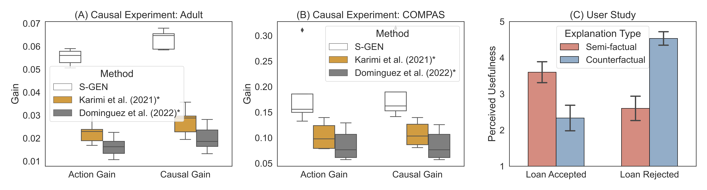

# Semifactual Recourse Generation (S-GEN) 
# NeurIPS-2023


This is the repository for the paper *"The Utility of "Even if..." Semifactual Explanation to Optimise Positive Outcomes*[^1].

The paper was published at NeurIPS 2023, New Orleans, U.S.A., see paper [here](https://openreview.net/forum?id=R6wXP7txer).

The paper proposes to think about the problem of algorithmic recourse different. Instead of focusing on making e.g. a rejected bank loan into an accepted one, we can also focus on taking an accepted bank loan, and making it even better for the user. Such a general framework for explainable AI could also be used to e.g. optimise people's dosage of certain medications, or a farmer's use of nitrogen (too much contributes to climate change).

In the above figure for example a user has their bank loan accepted, but our framework and algorithm S-GEN propose three possible actions the user could take to optimise their positive outcome. They could for example triple their bank loan and still be accepted.

These types of explanations that use "even if..." reasoning and don't cross a decision boundary are called semifactuals. To use these explanations in this context, we propose the notion of *Gain*, that is, how much a user stands to gain from the explanation. If a particular user would really like to increase their loan more, they experience positive gain if they do so, and likewise they experience *negative gain* if they decrease their loan amount. This formalisation allowed us to fully maximise our framework to help users optimise their positive outcomes into even better (and fairer) ones.

This repo uses a lot of the code from Dominguez et al.[^2] for the causal tests.

--------------

## Experiments

To reproduce these results run:

```
conda create --name semifactual
conda activate semifactual
conda install -c anaconda pandas
conda install -c anaconda seaborn
conda install -c anaconda scikit-learn
conda install -c conda-forge tqdm
conda install -c conda-forge jsonschema
conda install -c conda-forge imbalanced-learn
conda install pytorch::pytorch torchvision torchaudio -c pytorch
conda install -c conda-forge tensorboard
conda install -c conda-forge cvxpy
```

For the non-causal tests go into one dataset's folder and run
```
python main.py 'dataset_name'
```
And the results will reproduce. 

For the causal tests just run
```
python run_benchmarks.py
```

And the terminal will print off the results, reproducing the results for Car Racing from the paper.


--------------

## Results



You can see in the figures above how our method produces the most gain for users in our causal tests. Moreover, when you consider causality, people actually experience even more gain showing its importance in our framework. The figure on the right side shows our user study, in which users are shown to see semifactuals as being more useful than counterfactuals in the positive outcome of having a loan accepted. Likewise, counterfactuals are seen as more useful when loans are rejected (i.e., negative outcomes). This lends evidence that semifactuals should be the default explanation type in positive outcome settings.


------------------------

## Contact

For any questions or comments, please email ekenny@mit.edu.

-------------------------

### Bibtex

```
@inproceedings{
kennyHuangEvenIf,
title={The Utility of {\textquotedblleft}Even if{\textquotedblright} Semi-Factual Explanation to Optimise Positive Outcomes},
author={Kenny, E.M., Huang, W.},
booktitle={Thirty-seventh Conference on Neural Information Processing Systems},
year={2023},
url={https://openreview.net/forum?id=R6wXP7txer}
}
```


[^1]: Kenny, E.M., Huang, W., The Utility of "Even if..." Semifactual Explanation to Optimise Positive Outcomes. In *Thirty-seventh Conference on Neural Information Processing Systems.* New Orleans, U.S.A., 2023.

[^2]: https://github.com/ricardodominguez/adversariallyrobustrecourse


