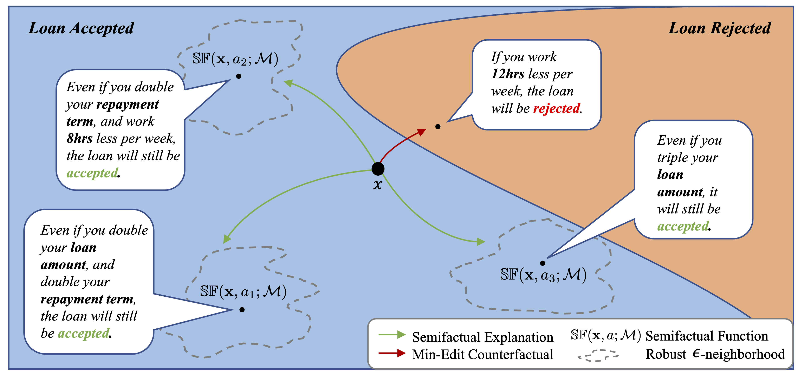

# Semifactual Recourse Generation (S-GEN) - NeurIPS-2023




This is the repository for the paper *"The Utility of "Even if..." Semifactual Explanation to Optimise Positive Outcomes*[^1].

The paper was published at NeurIPS 2023, New Orleans, U.S.A., see paper [here](https://openreview.net/forum?id=R6wXP7txer).

The paper proposes...

In the above figure for example...

This repo uses a lot of the code from Dominguez et al.[^2].

--------------

## Experiments

To reproduce these results run:

```
conda create --name semifactual
conda activate semifactual
conda install -c anaconda pandas
conda install -c anaconda seaborn
conda install -c anaconda scikit-learn
conda install -c conda-forge tqdm
conda install -c conda-forge jsonschema
conda install -c conda-forge imbalanced-learn
conda install pytorch::pytorch torchvision torchaudio -c pytorch
conda install -c conda-forge tensorboard
conda install -c conda-forge cvxpy
```

For the non-causal tests go into one dataset's folder and run
```
python main.py 'dataset_name'
```
And the results will reproduce. 

For the causal tests just run
```
python run_benchmarks.py
```

And the terminal will print off the results, reproducing the results for Car Racing from the paper.

------------------------

## Contact

For any questions or comments, please email ekenny@mit.edu.

-------------------------

### Bibtex

```
@inproceedings{
kennyHuangEvenIf,
title={The Utility of {\textquotedblleft}Even if{\textquotedblright} Semi-Factual Explanation to Optimise Positive Outcomes},
author={Kenny, E.M., Huang, W.},
booktitle={Thirty-seventh Conference on Neural Information Processing Systems},
year={2023},
url={https://openreview.net/forum?id=R6wXP7txer}
}
```


[^1]: Kenny, E.M., Huang, W., The Utility of "Even if..." Semifactual Explanation to Optimise Positive Outcomes. In *Thirty-seventh Conference on Neural Information Processing Systems.* New Orleans, U.S.A., 2023.

[^2]: https://github.com/ricardodominguez/adversariallyrobustrecourse


